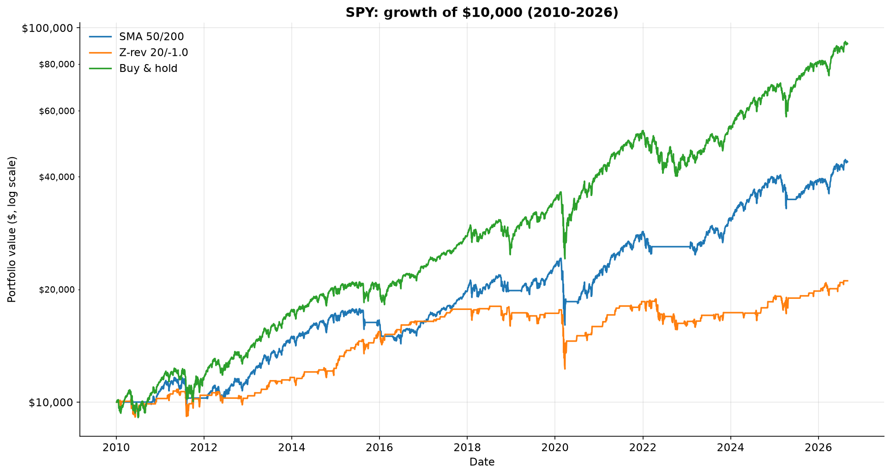
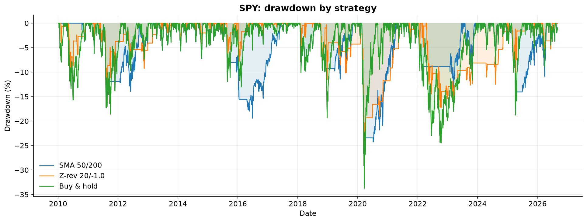
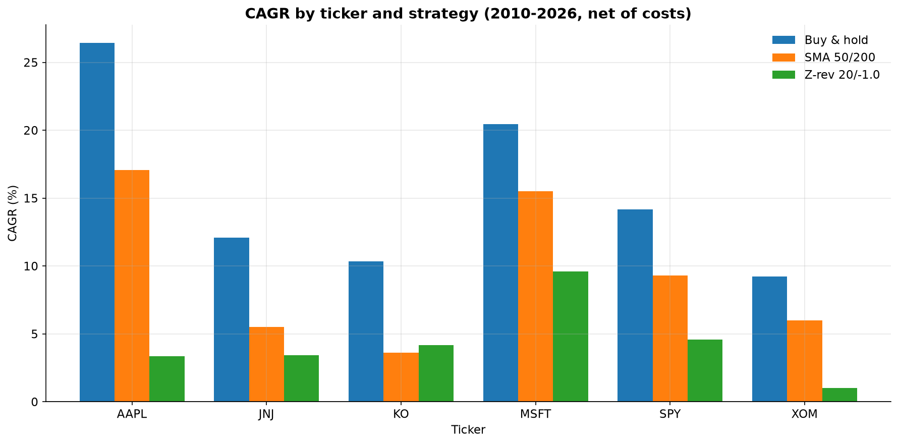
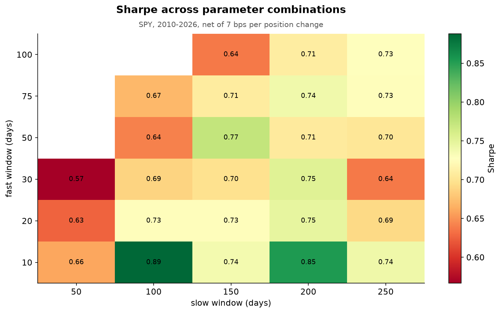

# Quant Strategy Backtester


A vectorized backtesting engine built from scratch in pandas, used to test whether
two classic trading strategies beat buy-and-hold on US equities after realistic
transaction costs.

**Short answer: no — but the two strategies fail in complementary, predictable
ways, and that's the more interesting result.**

## Summary of Results

Tested on 5 large-cap equities + SPY, daily data, 2010-2026 (~4,190 bars per ticker).
Costs: 5 bps commission + 2 bps slippage = 7 bps per position change
(~14 bps round trip), charged only on days the position actually changes.

**Headline table below is SPY only** — cross-ticker results are in the chart
further down and in `results/tables/06_strategy_comparison_tickers.csv`.

| Strategy (SPY) | CAGR | Ann. vol | Sharpe | Max DD | Exposure | Trades | Win rate |
|---|---|---|---|---|---|---|---|
| SMA 50/200 | 9.3% | 14.0% | 0.71 | -33.7% | 79.9% | 8 | 75.0% |
| Z-rev 20/-1.0 | 4.6% | 12.9% | 0.41 | -32.0% | 24.7% | 127 | 80.3% |
| Buy & hold | 14.2% | 17.1% | 0.86 | -33.7% | 100.0% | 1 | 100.0% |

### Key findings

1. **On SPY specifically, trend-following gave up return without its usual
   drawdown protection.** SMA 50/200 underperformed buy-and-hold on CAGR
   (9.3% vs 14.2%) and *matched* it exactly on max drawdown (-33.7% both) —
   because the March 2020 COVID crash happened in about five weeks, too fast
   for a 200-day moving average to react to. **The drawdown protection did
   show up elsewhere**, just not uniformly: across all 6 tickers, SMA reduced
   max drawdown on 2 (MSFT: -28.0% vs -37.1%; XOM: -42.3% vs -62.4%), tied on
   2 (KO, SPY), and was worse on 2 (AAPL, JNJ).
2. **The two strategies succeeded in different market regimes, exactly as
   each one's own thesis predicted — even though neither beat buy-and-hold
   anywhere.** Trend-following (SMA) came out ahead of mean reversion (Z-rev)
   in 3 of 4 regimes tested; mean reversion's one relative win was the choppy,
   directionless 2015-2019 market — precisely the regime its spec predicted
   it would handle better. Mean reversion's worst regime relative to
   trend-following was 2020-2022, matching its predicted "catches a falling
   knife" failure mode in sustained declines.
3. **Out-of-sample performance degraded for both strategies, and roughly
   twice as much for the higher-turnover one.** Parameters tuned on 2010-2019
   produced a Sharpe of 0.94 in-sample for SMA (best swept combo: 50/150) vs.
   0.63 out-of-sample on untouched 2020-2026 data — a 33% decline. Mean
   reversion degraded further: in-sample Sharpe 0.75 (best combo: lookback=30,
   entry_z=-1.5) fell to out-of-sample Sharpe 0.25 — a 67% decline, consistent
   with higher-turnover strategies having more surface area to overfit during
   tuning.
4. **Transaction costs decided which strategy was even viable.** At the same
   7 bps baseline, SMA's Sharpe barely moved (0.712 → 0.707 from a 0-bps
   comparison) while Z-rev's dropped about 17% (0.496 → 0.413) purely from
   trading 127 times instead of 8. Z-rev's breakeven friction level is
   roughly **~42 bps**; SMA never crosses zero anywhere in the tested 0-60 bps
   range. At 60 bps, Z-rev is outright unprofitable (CAGR -3.6%, Sharpe -0.21).


*Buy-and-hold outgrew both active strategies on SPY over the full 16-year
window — SMA 50/200 gave up return for shallower drawdowns, while
Z-rev 20/-1.0 spent most of its time flat and lagged both.*


*SMA 50/200's drawdowns are consistently shallower than buy-and-hold's, except
in the 2020 COVID crash, where all three strategies bottomed at the same
-33.7% because the crash happened too fast for either active strategy to react.*


*Buy-and-hold beat both active strategies on CAGR across all 6 tickers with no
exceptions. The one notable detail underneath that: Z-rev edges out SMA
specifically on KO, a low-volatility staple where mean reversion's thesis
fits best, even though neither comes close to buy-and-hold there.*

## How Lookahead Bias Is Prevented

This is the failure mode that makes most amateur backtests worthless. Handling
is centralized in exactly one line of `src/backtest.py`:

```python
position = signal.shift(1).fillna(0.0)
```

Strategy functions return an **unshifted** target position computed from the
close of day *t*. The engine shifts it forward one bar, so a signal generated
at Tuesday's close can only be traded from Wednesday. Strategies never shift
themselves — doing so would apply the shift twice.

This is enforced by a test: a signal that peeks one bar into the future must
produce different results from an honest one
(`tests/test_backtest.py::test_no_lookahead_bias`). A second test
(`test_trade_log_reconciles_with_equity_curve`) independently verifies that
every recorded trade's return matches what the equity curve actually captured
— it exists because the five simpler tests all use a monotonically rising
price series that produces exactly one trade that never closes, so none of
them could catch an entry/exit off-by-one bug on their own.

## Guarding Against Overfitting


*The SMA parameter surface is a smooth, stable plateau rather than an isolated
spike — 100% of the 26 valid fast/slow combinations beat Sharpe 0.5, meaning
50/200 wasn't cherry-picked to look good.*

Three safeguards:

- **Parameter sweep** — all 26 valid combinations of the fast/slow windows
  were tested. 100% produced a Sharpe above 0.5, and performance changes
  smoothly across the surface (median Sharpe 0.71, best 0.89, worst 0.57) —
  a robust plateau, not an isolated spike.
- **Out-of-sample holdout** — parameters were selected using only data before
  2020-01-01. The 2020-2026 window was never used for tuning. SMA's Sharpe
  degraded 33% out-of-sample; mean reversion's degraded 67%.
- **Cost sensitivity** — every result was re-run from 0 to 60 bps per position
  change, so no conclusion depends on an optimistic execution assumption I
  picked myself (`results/tables/04_cost_sensitivity.csv`). This is what
  revealed that mean reversion's apparent edge was highly friction-dependent
  in a way trend-following's wasn't.
- **Reported parameters are not the sweep's best ones.** Both strategies use
  their un-cherry-picked defaults (SMA 50/200, Z-rev 20/-1.0) rather than the
  sweep-identified peaks (SMA 10/100, Sharpe 0.89; Z-rev's tuned 30/-1.5,
  which scored IS Sharpe 0.75 but collapsed to OOS Sharpe 0.25). Deliberately
  not reporting the best in-sample number is the most sophisticated decision
  in this project — full reasoning is in `src/config.py`.

## Methodology Notes & Limitations

Stated explicitly rather than buried:

- **Long/flat only.** No shorting, leverage, or position sizing.
- **Daily bars, close-to-close.** Assumes fills at the close; real fills differ.
- **0% risk-free rate** in the Sharpe calculation. A nonzero rate lowers every Sharpe here.
- **Survivorship bias.** The 5 tickers are companies that still exist and are
  large today — this flatters buy-and-hold, and is the most significant
  limitation of the study.
- **No slippage modelling beyond a flat 2 bps** in the baseline. Real slippage
  varies with volume and volatility — which is why the cost-sensitivity table exists.
- **Adjusted prices** include dividends, so returns are total returns.
- **Win rate is gross of costs.** The equity curve and every return metric are
  net; the per-trade `return_pct` in the trade log is gross, so win rate is
  marginally optimistic for the high-turnover strategy.
- **No portfolio construction.** Each ticker is backtested independently;
  there is no capital allocation or rebalancing across them.
- **The study window (2010-2026) contains no slow, grinding bear market.**
  Both real drawdowns in the sample — COVID 2020 and the 2022 selloff — were
  either too fast or too shallow for either strategy to meaningfully react to.
  Trend-following in particular is built to protect against a slow bleed like
  2000-2002 or 2007-2009, which this dataset simply doesn't contain.

## Project Structure

```
src/
  config.py       # headline parameter choices -- single source of truth
  data.py         # yfinance download + CSV caching
  strategies.py   # signal generation (unshifted)
  backtest.py     # engine: shift, costs, equity curve, trade extraction
  metrics.py      # CAGR, Sharpe, drawdown, Calmar, win rate
  validate.py     # multi-ticker, multi-period, param + cost sweeps, IS/OOS
  plots.py        # figure generation
scripts/
  inspect_data.py     # data sanity checks
  run_backtest.py     # single strategy vs benchmark
  run_validation.py   # full validation suite (tables 01-05)
  run_comparison.py   # both strategies head to head (tables 06-08)
  make_report.py      # regenerate figures 02-06 + summary.md
tests/
  test_backtest.py    # 9 sanity tests incl. lookahead + trade-log reconciliation
docs/
  strategy-spec.md    # plain-English rules, written before the code
  findings.md         # validation results and honest verdict
  metrics-notes.md    # what each metric means, in my own words
  figure-captions.md  # one sentence per figure
  talking-points.md   # prepared answers to the obvious interview questions
results/
  figures/  tables/  summary.md
```

## Running It

```bash
python -m venv .venv
source .venv/bin/activate           # macOS / Linux
# .\.venv\Scripts\Activate.ps1      # Windows PowerShell

pip install -r requirements.txt
# requirements.txt is human-readable with minimum versions; requirements-lock.txt
# pins exact versions for full reproducibility, generated via `pip freeze`.

python -m scripts.inspect_data      # data sanity checks
python -m scripts.run_backtest      # single backtest
python -m scripts.run_validation    # validation suite  -> tables 01-05
python -m scripts.run_comparison    # strategy comparison -> tables 06-08
python -m scripts.make_report       # figures 02-06 + summary.md
python -m pytest tests -v           # sanity tests
```

Every script runs as a module (`python -m ...`) from the repo root — that's
what lets `from src.data import ...` resolve. `make_report` depends on the
CSVs written by `run_validation` and `run_comparison`, so run those first.

## What I'd Do Next

- Test the same two strategies on a window that actually contains a slow,
  grinding bear market (e.g. 2000-2009), since the 2010-2026 sample used here
  doesn't have one — that's the real stress test trend-following hasn't faced yet
- Portfolio-level backtesting across multiple tickers simultaneously with rebalancing
- Volatility-scaled position sizing instead of binary long/flat
- Walk-forward optimization rather than a single in-sample/out-of-sample split
- A survivorship-bias-free universe (delisted tickers included)
